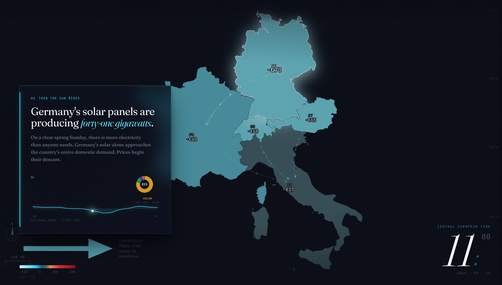

# The Price of Wind and Sun

An interactive scrollytelling piece on how Germany's renewable build-out reshapes wholesale electricity prices across Switzerland, France, Italy, and Austria.

**[→ View the live site](https://com-480-data-visualization.github.io/HSquareB/)**



On a sunny Sunday in May 2024, German solar pushed so much power onto the grid that Switzerland cleared at **−€145.12 per MWh at 13:00**, below Germany at the same hour. Switzerland barely produces solar. Italy, two interconnectors away, was still trading at positive prices.

## What it does

- Seven-step scroll narrative on a sticky five-country map (CH, DE-LU, FR, IT-NORD, AT)
- Interactive explorer with timeline scrubber, country sidebar, and a price-vs-renewable-share colour toggle
- Four chart modules: calendar heatmap, generation stack, daily price profile, small multiples
- Python pipeline that regenerates every JSON artefact from the raw CSV in under a minute

## Tech stack

| Layer | Tool |
|---|---|
| Rendering | D3 v7 (SVG + Canvas), vanilla ES modules |
| Scroll | Scrollama v3 |
| Map | `world-atlas` TopoJSON, filtered to five countries (17 KB) |
| Preprocessing | Python 3.9, pandas, pyarrow |
| Hosting | GitHub Pages, static from `docs/` |

No framework, no build step.

## Dataset

[ENTSO-E Transparency Platform](https://transparency.entsoe.eu/), 2024 to mid-2025: 301,391 hourly rows across 23 bidding zones, day-ahead prices and generation by fuel. The raw CSV at `data/entsoe_data_2024_2025.csv` is immutable; everything under `docs/data/processed/` is regenerated from it.

## Running locally

```bash
python3 -m venv .venv
.venv/bin/pip install -r requirements.txt

.venv/bin/python scripts/build_topojson.py   # map geometry (optional)
.venv/bin/python scripts/preprocess.py       # CSV to JSON
.venv/bin/python scripts/explore.py          # dataset diagnostic

python3 -m http.server 8000
# open http://localhost:8000/docs/
```

## Structure

```text
HSquareB/
├── data/entsoe_data_2024_2025.csv    raw (immutable)
├── scripts/                          build_topojson, preprocess, explore
├── docs/                             the site (served by GitHub Pages)
│   ├── index.html
│   ├── css/style.css
│   ├── data/processed/               JSON artefacts
│   └── js/
│       ├── main.js                   entry, scroll orchestration
│       ├── map.js                    D3 map module
│       ├── narrative.js              per-step handlers
│       ├── explorer.js               interactive explorer
│       ├── charts/                   chart factories
│       └── utils/                    colour scale, data loaders
├── milestone_1/, milestone_2/
└── requirements.txt
```

## Team

| Name | SCIPER |
|---|---|
| Brian Banna | 356437 |
| Lê Thào Huyèn | 355566 |
| Hajj Hannah | 346545 |

Built for COM-480 Data Visualization, EPFL, Spring 2026.
