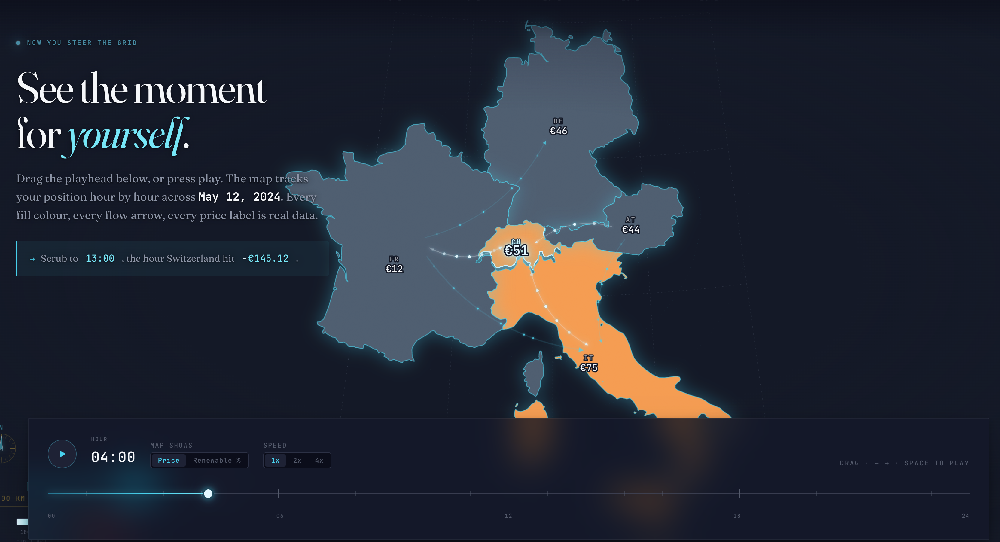
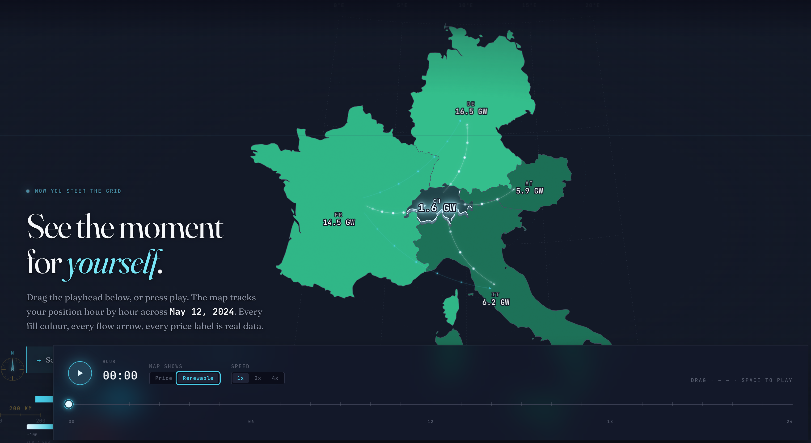

# The Price of Wind and Sun

**Team HSquareB**: Brian Banna (356437), Lê Thào Huyèn (355566), Hajj Hannah (346545)

Live website: [https://com-480-data-visualization.github.io/HSquareB/](https://com-480-data-visualization.github.io/HSquareB/)

## 1. Project goal

### 1.1 Thesis

On Sunday 12 May 2024, German solar output was high enough that Switzerland's wholesale electricity price dropped to -€145.12 per MWh at 13:00, below Germany's own price at the same hour. This is striking because Switzerland has far less solar capacity than Germany. Whereas, Italy, two interconnectors further south, was still trading at positive prices.

Later, however, Germany's renewable build-out has reached a point where its weekend solar production sets the clearing price across five central European markets at once.

The goal of the visualisation is to make that cross-border price transmission visible, not just describe it merely in text.

### 1.2 Motivation

Renewable integration is usually framed as a domestic story: capacity installed, emissions avoided, bills reduced. The cross-border side gets less attention because it is harder to show. Interconnectors turn national energy policy into a regional effect. Most of the time they just smooth out weather variation. When supply overshoots demand, they propagate the price drop across the network within the hour. Anyone following European power markets benefits from seeing that mechanism directly, and from seeing how much it has intensified between 2024 and 2025.

By the end of the piece the reader should be able to answer four questions: does Germany's solar peak reach the price formation of its neighbours, which neighbours absorb the shock hardest and why, how fast the pattern has intensified across the eighteen-month window, and who is insulated from it. The site targets energy-literate general readers, undergraduate economics and energy students, and anyone following the European power-market news cycle. Technical terms (bidding zone, merit-order stack, duck curve, Dunkelflaute) are introduced inline on first use.

## 2. Exploratory data analysis

We use the ENTSO-E Transparency Platform download covering 1 January 2024 through 30 June 2025: 301,391 hourly observations across 23 bidding zones, with day-ahead prices and generation broken down by fuel. A _bidding zone_ is the area within which the wholesale electricity price is the same at any given hour. Most countries are a single zone, Italy is split into several regional zones, and Germany shares one with Luxembourg. We filter to five zones that share physical interconnectors across the Alps and the Rhine: Switzerland (CH), Germany-Luxembourg (DE_LU), France (FR), Northern Italy (IT_NORD), and Austria (AT). Belgium and the Netherlands also border Germany and see a lot of negative prices, but they are two interconnectors removed from Switzerland and sit outside the scope we care about here.

Germany is at the centre of this story for three concrete reasons. It has far more installed renewable capacity than Switzerland, the country at the heart of our story: around 90 GW of solar and 70 GW of onshore and offshore wind in 2024, against Switzerland's roughly 7 GW of solar and wind combined. That gives it the scale to move continental prices on its own. It sits at the physical centre of the synchronous area and shares direct interconnectors with four of the other five focus zones, so a price shock on its grid travels outward through the rest. And the causality only runs one way: when the German market clears below zero, the neighbours almost always clear below zero too (Section 2.2 gives the numbers), while positive German hours line up with positive hours everywhere else. The German _Energiewende_ is the policy driving the effect we are measuring, so the rest of the analysis treats the other four countries as the places that catch the signal rather than the places that produce it.

### 2.1 Distribution of negative-price hours

We start by counting how often each market clears below zero. Over eighteen months, Germany cleared negative 846 times (6.5% of all hours), France 715 (5.5%), Austria 584 (4.5%), and Switzerland 529 (4.0%). Northern Italy never went negative, zero out of the entire window. The ordering points to two different dynamics behind the numbers. France's 715 hours are mostly produced at home: its nuclear fleet is slow to ramp down, so when wind output is high the combined supply overshoots demand even without imports from Germany. Austria's count comes from a different place. Austria and Germany ran as a single bidding zone until 2018 and are still inside the same synchronous area, so negative hours in one almost always show up in the other. Switzerland is the interesting case. It has some solar but not nearly enough to oversupply its own market, no wind to speak of, and a flexible hydro fleet. On its own fundamentals nothing should push its clearing price below zero. It still went negative 529 times. Italy, on the other side of the Alps with a gas-heavy generation mix, never went negative.

 

### 2.2 Coincidence with German negative hours

For each neighbouring country we counted how many of its own negative-price hours fell inside the same hour as a German negative. Austria sits at 89.7% (524 of 584), Switzerland at 88.8% (470 of 529), and France at 80.6% (576 of 715). Austria's high number is not surprising. It shared a single bidding zone with Germany until 2018 and is still inside the same synchronous area, so the two markets clear together at the bottom. France has a larger absolute count but a lower coincidence rate, because a lot of its negative hours come from its own nuclear-plus-wind supply stack rather than from imports.

Switzerland is the finding that drives the rest of the project. It has no structural reason to track Germany like that. It is outside the EU internal market, not in the same bidding zone, and only physically connected through AC lines across the Rhine and the Alps. And yet, on 88.8% of the hours its price drops below zero, Germany is already there. Switzerland is not producing those hours. It is importing them through the grid.

### 2.3 The duck curve is widening, fast

The _duck curve_ is the shape you get when you plot a typical day's electricity price (or net load) hour by hour and solar dominates the middle of the day. Prices drop through the morning, hit a deep midday trough (the duck's belly) as cheap solar floods the system, and then climb steeply in the evening (the duck's head) when the sun sets and demand peaks. The deeper the belly, the more solar is in the mix.

We computed the monthly average price profile for each country across all eighteen months. Germany's average midday price at hour 13 fell from +€16.17 per MWh in May 2024 to -€12.15 per MWh in May 2025. In one year, on a monthly-average basis, the duck's belly crossed below zero.

All five countries have the same daily shape: a midday trough at hour 13 or 14, an evening peak at hour 19. What differs is the absolute level and the depth of the trough. That is what Step 7 of the visualisation communicates. The daily rhythm is shared, the intensity is not. We only noticed this after running the EDA and seeing the peak hours line up across all five.

### 2.4 Seasonality of renewable share

Germany's monthly renewable share (solar + wind + hydro as a fraction of total generation) approaches 70% in the summer months of 2024 and exceeds it in 2025. Italy stays heavily gas-dependent throughout. Austria sits near 84% year-round, mostly hydro with a growing share of wind and solar. France runs at a stable 20 to 30%, dominated by nuclear with fossil fuels as a buffer. Each country's mix produces a distinct price profile, and the narrative has to make those differences visible.

 

## 3. Visualisation plan

### 3.1 Architecture

The site is a single scrollytelling page with a sticky map underneath. The five-country map stays on screen throughout, and the reader scrolls through seven editorial cards that change its state (time of day, price colouring, flow arrows, annotations). After the last card, the scroll opens into an interactive explorer where the reader can drive the same map themselves.

### 3.2 The seven narrative steps

Two terms used below. A _mix donut_ is a small donut chart showing the share of each fuel in the current generation mix (solar, wind, nuclear, gas, hydro). A _merit-order stack_ is the mechanism the market uses to set a price: generators are lined up from cheapest marginal cost (nuclear, renewables) to most expensive (gas peakers), stacked up until supply meets demand, and the last unit needed sets the clearing price. When cheap renewables alone cover demand, the price collapses. When they overshoot, it goes negative.

1. **Midnight baseline.** Calibrate the reader on the map, colour scale, and legend. Five-country map, muted prices, clock at 00:00.
2. **Dawn solar ramp.** Germany wakes up; the mix donut shows solar dominance. Map tints, generation donut pinned beside DE.
3. **The peak moment.** 13:00, 12 May 2024. Switzerland at -€145.12, below Germany. Flow arrows radiate from DE and out of CH. Ice-white CH, hero number bloom.
4. **Year in one view.** Calendar heatmap of every hour in 2024 and 2025 for DE and CH, toggleable. Canvas heatmap, 13,104 cells per country.
5. **Merit-order stack.** Germany's generation stack for the showcase day with price overlay and load line. Stacked area + line chart, animated reveal.
6. **Duck curve forming.** Monthly cycling of Germany's profile from January 2024 to June 2025 over a ghost annual average. 24-hour line chart, animated month transitions.
7. **Five identities.** Small-multiples grid of all five countries' annual profiles. Three-by-two grid of compact 24-hour line charts.

### 3.3 Interactive explorer

After the guided story, the reader can drive the map themselves. A timeline scrubber covers one full showcase day in hourly steps. Playback runs at 1x, 2x or 4x speed, with the Space bar and the arrow keys as keyboard shortcuts. Clicking any country opens a sidebar showing that country's generation stack, daily price profile with the annual average shown as a ghost line, and summary stats (current price, renewable share, spread to Italy). A colour-mode toggle recolours the map to show renewable energy production instead of price.

 

### 3.4 Visual language

The site runs dark-only. The background is a three-level navy ramp. The price scale is a diverging sequential from ice-white for deep negatives (where the drama lives), through the navy baseline, to warm orange and red for positive peaks. Using ice-white for extreme negatives is a deliberate inversion of the usual "darker equals more extreme" convention: negative prices are the thing we want the reader to notice, so they get the brightest treatment. Typography pairs Fraunces (variable serif, used at display sizes for the hero numbers and editorial copy) with JetBrains Mono (for every data value, timestamp, country code, and legend). Numbers are never set in the serif. The palette choice draws on Lecture 6.1 (perception and colour) and the typographic hierarchy on Lecture 7.1 (designing visualisations).

## 4. Execution

### 4.1 Plan of attack and how we operate

The end-to-end prototype is live and already contains the core visualisation. We built it iteratively, starting with the reproducible data pipeline and adding the narrative layer on top. What is already working:

- Five-country map rendered from a 17 KB TopoJSON with price-driven colouring and flow arrows
- Seven-step narrative scroll wired through Scrollama, with per-step map state changes
- Timeline scrubber on the explorer with play / pause, speed control, and keyboard shortcuts
- Reproducible Python pipeline that regenerates every JSON artefact from the raw CSV
- Click-to-inspect country sidebar with generation stack, daily profile, and summary stats
- Price vs renewable-share colour toggle on the explorer map

The work we operate on from here through Milestone 3: polish and transitions, accessibility and mobile responsiveness, an annotation layer for named events (German holidays, negative-price records, _Dunkelflaute_ hours), a colour-vision-deficient audit of the generation-stack palette, and the 2-minute screencast and process book.

### 4.2 Course lectures

Applied so far: Lectures 1 and 2 to 3 for project framing and vanilla JavaScript, 4 for D3 joins, scales, transitions, stacked areas, and small multiples, 5 for the scrubber and sidebar interactions, 6 for the price-scale design and encoding trade-offs, 7 for hierarchy and typography, and 8 for the map (conic-conformal projection on Munich, TopoJSON for five countries, flow-arrow layer).

### 4.3 Division of labour

**Brian Banna** leads the data pipeline (Python, ENTSO-E to JSON) and the front-end engineering (D3 chart modules, scroll orchestration, map rendering, interactive explorer). **Lê Thào Huyèn** leads narrative design and storytelling (seven-step structure, card copy, hero-moment framing, reading flow). **Hajj Hannah** leads exploratory analysis and the visual design system (colour palette, typography, small-multiples language, page composition). Sketching and storytelling were shared across all three members in the design phase; ownership reflects who led each domain through to shipped code or shipped copy.
